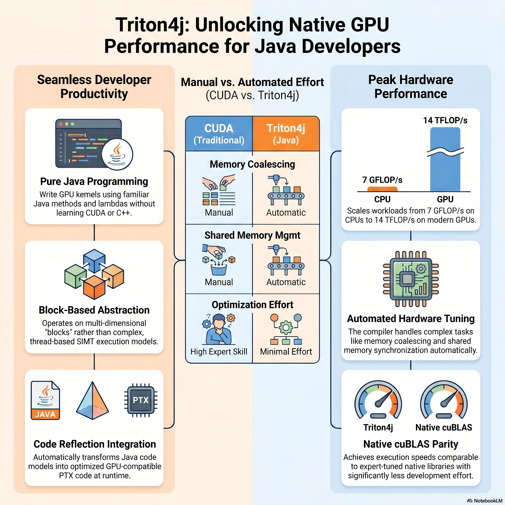

# TritonParser



[](LICENSE)


## About
TritonParser converts Triton-style Python kernels into Babylon/Triton-compatible Java source code.
It combines a generated Python parser (`org.parsers.python.*`) with a Java codegen pipeline (`org.triton4j.codegen.TritonWriter`) so Java projects can use Triton-style GPU kernel workflows without rewriting core logic in Python.
It also includes TurboQuant samples, benchmark tooling, and HAT runtime experiments so we can move from code generation into executable Java-side accelerator workflows with JSON performance reports.

## Topics
`triton` `babylon` `java` `codegen` `parser` `gpu` `ml-kernels` `python-parser`

## Purpose
TritonParser converts Python Triton-style kernels into Java source code that targets the Babylon/Triton Java APIs.

It combines:
- A Python parser (`org.parsers.python.*`) for reading `.py` sources.
- A code generator (`org.triton4j.codegen.TritonWriter`) that emits Java methods annotated with `@Reflect` and uses `oracle.code.triton.*`.
- Tests that validate generated/handwritten kernels against expected Triton IR behavior.

It now also serves as a small experimentation workspace for:
- TurboQuant quantized attention kernels and reference implementations.
- CLI and sample benchmarks that emit JSON reports under `build/reports/performance/`.
- HAT runtime execution tests that run reflected kernels on Java sequential and multithreaded backends.

## Why Triton
Triton is a GPU kernel programming model focused on high-performance tensor operations (for example, vector math, matrix multiply, softmax, and fused kernels). It gives low-level control over memory/layout/tiling while keeping kernel authoring more compact than raw CUDA-style code.

In practice, Triton is used to:
- write custom GPU kernels for ML workloads,
- tune performance-critical kernels,
- express operations that are hard to optimize through generic library calls.

## Why Java Babylon Triton
Java Babylon Triton brings Triton-style kernel authoring and transformation into Java programs through code reflection (`@Reflect`) and code model lowering. This lets Java code participate in the same kernel pipeline without switching the whole application to Python.

For Java applications, this helps by:
- keeping kernel logic close to Java business/runtime code,
- enabling reflection-driven transformation and validation in Java tests,
- making custom GPU kernels available through Java APIs (`oracle.code.triton.*`).

## Babylon + HAT Context (OpenJDK article)
Reference: [Optimizing GPU Programs from Java using Babylon and HAT](https://openjdk.org/projects/babylon/articles/hat-matmul/hat-matmul) (January 2026).
Babylon repository: [openjdk/babylon](https://github.com/openjdk/babylon).

Key ideas from that article that are relevant here:
- **Code reflection as the bridge**: Java methods annotated with `@Reflect` are turned into code models, transformed, and lowered to accelerator backends.
- **GPU programming model in Java**: HAT exposes explicit GPU concepts (kernel context, ND-Range/thread layout, memory interfaces) while keeping Java as the authoring language.
- **Optimization workflow is incremental**: The matrix-multiplication walkthrough applies common GPU optimization stages (2D kernels, memory coalescing, shared-memory tiling, register tiling, vectorization, FP16).
- **Performance intent is native-competitive**: the article reports scaling from CPU-level GFLOP/s to multi-TFLOP/s GPU execution and compares against cuBLAS, showing that Java-side tuning can approach native-library performance.

How this relates to TritonParser:
- This repository focuses on the **front-end/codegen side**: parsing Triton-like kernels and generating Java code that fits Babylon/Triton APIs.
- The generated code (`@Reflect` + `oracle.code.triton.*`) is the shape expected by the same broader Babylon ecosystem discussed in the HAT article.

## What This Repository Contains
- `src/main/java/org/parsers/python`: Python lexer/parser and AST model.
- `src/main/java/org/triton4j/codegen`: Python AST -> Java code generation.
- `src/main/java/org/triton4j/cli`: CLI entry points for code generation and command-level benchmarking.
- `src/main/java/org/triton4j/samples/turboquant`: TurboQuant Java sample, benchmark, and Triton kernel entry points.
- `samples/`: runnable CLI conversion examples and usage guide.
- `src/test/python`: Sample Triton Python kernels used for generation.
- `src/test/java/org/triton4j/codegen/test/TritonWriterTest.java`: Example generation flow.
- `src/test/java/oracle/code/triton/*`: Triton transformation/validation tests.
- `src/test/java/org/triton4j/codegen/test/HatKernelExecutionTest.java`: HAT vector-add runtime benchmark and report generation.
- `src/test/java/org/triton4j/samples/turboquant/TurboQuantHatExecutionTest.java`: HAT runtime execution test for fused TurboQuant attention.

## Prerequisites
- JDK 25 with Babylon module support (`jdk.incubator.code`).
  - Example from this setup:
    - `$HOME/Java/babylon/build/macosx-aarch64-server-release/images/jdk`
- Local Maven artifact:
  - `oracle.code:triton:1.0-SNAPSHOT`
  - This project resolves it from `mavenLocal()`.

## Build
```bash
export JAVA_HOME=$HOME/Java/babylon/build/macosx-aarch64-server-release/images/jdk
export PATH="$JAVA_HOME/bin:$PATH"
./gradlew clean build
```

### Convenience: pin Babylon JDK for this repo
Add this helper to your shell profile (`~/.zshrc`) so you can switch quickly when working in this project:

```bash
use_triton_jdk() {
  export JAVA_HOME="$HOME/Java/babylon/build/macosx-aarch64-server-release/images/jdk"
  export PATH="$JAVA_HOME/bin:$PATH"
  java --list-modules | grep jdk.incubator.code
}
```

Then run:

```bash
cd /path/to/TritonParser
use_triton_jdk
./gradlew build
```

### Optional: Metal Toolchain Environment (macOS)
Use this when you want Metal tools first on `PATH`:

```bash
export METAL_TC_BIN=/var/run/com.apple.security.cryptexd/mnt/com.apple.MobileAsset.MetalToolchain-v*/Metal.xctoolchain/usr/bin
export JAVA_HOME=$HOME/Java/babylon/build/macosx-aarch64-server-release/images/jdk
export PATH="$METAL_TC_BIN:$JAVA_HOME/bin:$PATH"
```

### How Metal Works With This Project
`TritonParser` itself does not compile Metal kernels directly. It does front-end conversion:
- parse Triton-style Python,
- generate Java methods (`@Reflect`) calling `oracle.code.triton.Triton.*`.

Backend compilation/execution happens later in the Babylon/Triton runtime pipeline.
On macOS, that backend pipeline can target Metal.

End-to-end flow:
1. Python `.py` kernel -> generated Java (`TritonWriter`).
2. Generated Java is reflected/lowered to Triton code model (`TritonTransformer`).
3. Runtime/backend layer emits backend code for the active target.
4. On macOS target, Metal toolchain binaries (`metal`, `metallib`, `air-*`) are used by that backend layer.

What `METAL_TC_BIN` does:
- puts Apple Metal compiler tools on `PATH`,
- allows backend stages that shell out to Metal tools to resolve them reliably.

Important JDK note:
- This project requires `jdk.incubator.code` (used by `@Reflect` and Triton lowering).
- Stock `25-open` does **not** contain `jdk.incubator.code`.
- Use the Babylon JDK for build/tests/codegen in this repository.

### Metal Environment Tasks
The build includes two helper tasks for Metal-related validation:

- `checkMetalEnv`
  - Validates `METAL_TC_BIN`, `metal`, `metallib`, and `jdk.incubator.code`.
  - Runs checks on macOS.
  - Skips automatically on non-macOS.
- `metalBuild`
  - Runs `build`.
  - On macOS, runs `checkMetalEnv` first.
  - On non-macOS, behaves like a regular build wrapper.

Examples:

```bash
./gradlew checkMetalEnv
./gradlew metalBuild
```

If you need environment changes to be picked up cleanly, run with:

```bash
./gradlew --no-daemon checkMetalEnv
```

## How To Use
For runnable examples, see:
- `samples/README.md`

### 1) Command-line interface (`picocli`)
Show help:

```bash
./gradlew run --args="--help"
```

Generate Java from one Python file:

```bash
./gradlew run --args="generate tutorials_python/01-vector-add.py -o build/generated-cli -p org.triton4j.triton.test -c VectorAdd"
```

Generate from a directory recursively:

```bash
./gradlew run --args="generate tutorials_python -o build/generated-cli -p org.triton4j.triton.test --continue-on-error"
```

Run from the built jar:

```bash
java --add-modules jdk.incubator.code -jar build/libs/dscope-triton-0.1.0.jar generate tutorials_python/01-vector-add.py -o build/generated-cli -p org.triton4j.triton.test
```

### 2) Gradle plugin-based generation
This repository includes a local Gradle plugin (`org.triton4j.codegen`) that adds:
- task: `generateTritonJava`
- extension: `tritonCodegen { ... }`

Default config in `build.gradle`:
- input: `tutorials_python/`
- output: `build/generated-triton-java/`
- package: `org.triton4j.triton.test`
- continue on generation errors: `true`

Run generation only:

```bash
./gradlew generateTritonJava
```

Run full build (generation is included):

```bash
./gradlew build
```

### 3) Generate Java code from sample Python kernels (JUnit harness)
Run the generation test harness:

```bash
./gradlew test --tests org.triton4j.codegen.test.TritonWriterTest
```

This generates Java files under:
- `org/triton4j/triton/test/`

Current generated examples include:
- `VectorAdd.java`
- `FusedSoftmax.java`
- `MatrixMultiplication.java`
- `GroupedGEMM.java`

### 4) Use `TritonWriter` programmatically
Minimal usage pattern:

```java
TritonWriterContext ctx = new TritonWriterContext();
ctx.packageName = "org.triton4j.triton.test";
ctx.verbose = true;

TritonWriter writer = new TritonWriter();
writer.write(
    ctx,
    Path.of("src/test/python/01-vector-add.py"),
    Path.of(""),
    "VectorAdd",
    "Vector Add"
);
```

### 5) Parse Python files directly (parser harness)
`PyTest` is a command-line parser harness in `src/test/java/PyTest.java`.

Compile test classes, then run:

```bash
./gradlew testClasses
java -cp build/classes/java/main:build/classes/java/test PyTest src/test/python
```

Flags:
- `-p`: parse in parallel
- `-q`: quiet output
- `-r`: retain parsed ASTs in memory

### 6) Compare performance in GPU vs non-GPU modes
Use the CLI benchmark subcommand to run two commands repeatedly and compare wall-clock timing.

This is useful when you run the same workload in two environments (for example, Metal/GPU enabled vs CPU/fallback).

Example:

```bash
./gradlew run --args="benchmark \
  --gpu-cmd 'METAL_TC_BIN=/path/to/Metal.xctoolchain/usr/bin JAVA_HOME=$HOME/Java/babylon/build/macosx-aarch64-server-release/images/jdk PATH=$METAL_TC_BIN:$JAVA_HOME/bin:$PATH ./gradlew --no-daemon metalBuild' \
  --cpu-cmd 'JAVA_HOME=$HOME/Java/babylon/build/macosx-aarch64-server-release/images/jdk PATH=$JAVA_HOME/bin:$PATH ./gradlew --no-daemon build' \
  --report-file build/reports/performance/cli-benchmark.json \
  --warmup 1 \
  --iterations 5"
```

Notes:
- The benchmark command measures total command runtime.
- It is a practical integration benchmark for environment-level comparisons.
- It does not directly launch Triton kernels from Java in-process (current `oracle.code.triton.Triton.*` APIs in this setup are transform-time stubs).
- If `--report-file` is set, benchmark results are also written as JSON.
- The default example report path is `build/reports/performance/cli-benchmark.json`.

The JSON report includes:
- timestamp, workdir, warmup and iteration counts,
- the exact GPU/CPU commands that were run,
- optional environment overrides passed with `--env`,
- per-iteration timings plus min/max/avg summary values.

### 7) Test in-process kernel execution with HAT backends
Run the kernel execution benchmark test:

```bash
./gradlew test --tests org.triton4j.codegen.test.HatKernelExecutionTest
```

What it does:
- Executes a reflected vector-add kernel through `hat.Accelerator.compute(...)`.
- Runs both Java HAT backends:
  - `hat.backend.java.JavaSequentialBackend`
  - `hat.backend.java.JavaMultiThreadedBackend`
- Validates output correctness and prints average runtime + speedup (`seq/mt`).
- Writes a JSON report to:
  - `build/reports/performance/hat-kernel-execution.json`

### 8) Run the TurboQuant sample and benchmark
TurboQuant lives under `src/main/java/org/triton4j/samples/turboquant/` and gives this project a concrete quantized-attention workload to generate, benchmark, and validate.

Main components:
- `TurboQuantCore`: pure Java quantization, dequantization, fused score path, and fused attention path.
- `TurboQuantTritonKernels`: Triton4j kernel entry points that represent the fused quantized attention kernels.
- `TurboQuantSample`: runnable sample that prints compression ratio, fused-vs-reference quality, and benchmark summary.
- `TurboQuantAttentionBenchmark`: benchmark runner that compares fused, dequantized-reference, and original-key paths.
- `TurboQuantBenchmarkCli`: benchmark-only CLI entry point used by the Gradle task.

Run the sample:

```bash
./gradlew runTurboQuantSample
```

Run the benchmark export task:

```bash
./gradlew benchmarkTurboQuant
```

Override benchmark parameters:

```bash
./gradlew benchmarkTurboQuant -PturboQuantHeadDim=128 -PturboQuantSeqLen=512 -PturboQuantBits=3 -PturboQuantWarmupRuns=2 -PturboQuantMeasuredRuns=12 -PturboQuantSeed=7
```

TurboQuant benchmark report:
- `build/reports/performance/turboquant-attention.json`

### 9) Validate TurboQuant on the HAT runtime
The project now includes a HAT runtime test that executes the fused TurboQuant attention path through `hat.Accelerator.compute(...)` on both Java HAT backends.

Run it with:

```bash
./gradlew test --tests org.triton4j.samples.turboquant.TurboQuantHatExecutionTest
```

What it verifies:
- reflected HAT kernel dispatch works for the fused TurboQuant attention computation,
- sequential and multithreaded Java backends both stay close to the Java fused reference,
- performance data is written to:
  - `build/reports/performance/turboquant-hat-attention.json`

### 10) Compare TurboQuant Java results with GraalPy
There is also a GraalPy-based parity test for the TurboQuant sample math.

Run it with:

```bash
./gradlew test --tests org.triton4j.samples.turboquant.TurboQuantGraalPyParityTest
```

What it verifies:
- Java TurboQuant fused score output matches a pure-Python reference executed in GraalPy,
- Java TurboQuant fused attention output matches the same GraalPy reference,
- the Triton4j TurboQuant kernel entry points remain annotated with `@Reflect`.

Note:
- this test does not execute the original PyTorch/Triton Python sources directly,
- instead it uses a GraalPy-compatible pure-Python reference because the current GraalPy setup in this project does not provide `torch` and `triton`.

## Troubleshooting
- `Could not resolve oracle.code:triton:1.0-SNAPSHOT`
  - Ensure the artifact exists in `~/.m2/repository/oracle/code/triton/1.0-SNAPSHOT`.
- `package jdk.incubator.code does not exist`
  - Ensure you are building with a Babylon JDK that includes `jdk.incubator.code`.
- Build uses incubator/module warnings
  - Expected for this project.
